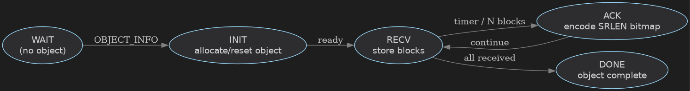

# UDP Object Build Protocol – Sender & Receiver

This document describes sender and receiver behavior using pseudocode and annotated state diagrams.

---

## Sender State Machine


### Sender Pseudocode

```text
send_object(obj):
    send OBJECT_INFO(obj)

    while not all blocks ACKed:
        for each block i missing and under send limit:
            send OBJECT_DATA(obj, i)

        wait until:
            ACK received OR resend timer fires

        if ACK received:
            decode SRLEN bitmap
            mark received blocks
```

### Timing & Retransmission Rules

- Sender limits outstanding DATA blocks (implementation-defined)
- Sender retransmits based solely on ACK bitmap state
- No per-packet timers are required
- Periodic resend may be used if ACKs stall

---

## Receiver State Machine



### Receiver Pseudocode

```text
on OBJECT_INFO(obj):
    allocate/reset object storage
    clear received bitmap

on OBJECT_DATA(obj, block):
    if block not yet received:
        store data
        mark bitmap

periodically or after N blocks:
    encode bitmap window with SRLEN
    send OBJECT_ACK

if all blocks received:
    finalize object
```

### ACK Timing Rules

- Receiver emits ACKs periodically or after N received blocks
- ACKs are authoritative and idempotent
- ACK window may slide using block_start

---

## Key Properties

- Reliable object construction over UDP
- No packet ordering requirements
- Block-level selective retransmission
- Robust to loss, duplication, and reordering

